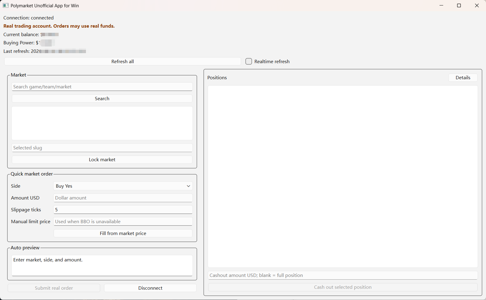
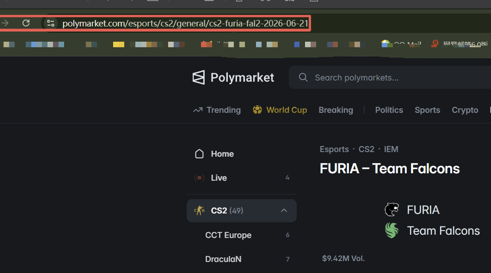

# Polylite for Windows

Unofficial lightweight desktop app for manual Polymarket US trading on Windows.

Polylite is a local PySide6 GUI built on the `polymarket-us` SDK. It is designed for personal account access: search or paste a market URL, lock one market, preview an order, and submit only after confirmation.



## Highlights

- Local Windows desktop app. No cloud backend or web service.
- Polymarket US only.
- Search by market URL, slug, team name, or keyword.
- Lock one market before trading.
- Buy either side with a USD amount.
- Sell through the Positions cashout panel.
- Automatic `orders.preview()` before submit.
- Explicit confirmation before `orders.create()`.
- Balance, buying power, compact positions, PnL, and details view.
- Manual refresh and optional realtime refresh.
- API credentials are kept in process memory only.

## Install

Install `uv` in PowerShell:

```powershell
powershell -ExecutionPolicy ByPass -c "irm https://astral.sh/uv/install.ps1 | iex"
```

Clone and install:

```powershell
git clone https://github.com/am1nuos1/polylite-for-windows.git
cd polylite-for-windows
uv python install 3.12
uv venv --python 3.12
uv pip install -e ".[dev]"
```

## Run

Double-click:

```text
run_quick_trade.bat
```

Or run from PowerShell:

```powershell
uv run python -m polymarket_terminal.quick_trade
```

Equivalent commands:

```powershell
uv run python -m polymarket_terminal
uv run polymarket-quick-trade
```

## API Credentials

Trading and account data require Polymarket US API credentials.

The app reads:

```text
POLYMARKET_KEY_ID
POLYMARKET_SECRET_KEY
```

Set them for the current PowerShell session:

```powershell
$env:POLYMARKET_KEY_ID = "your-key-id"
$env:POLYMARKET_SECRET_KEY = "your-secret-key"
uv run python -m polymarket_terminal.quick_trade
```

Set them persistently for your Windows user:

```powershell
[Environment]::SetEnvironmentVariable("POLYMARKET_KEY_ID", "your-key-id", "User")
[Environment]::SetEnvironmentVariable("POLYMARKET_SECRET_KEY", "your-secret-key", "User")
```

Open a new PowerShell window after setting persistent variables.

Remove them:

```powershell
[Environment]::SetEnvironmentVariable("POLYMARKET_KEY_ID", $null, "User")
[Environment]::SetEnvironmentVariable("POLYMARKET_SECRET_KEY", $null, "User")
```

## Usage

1. Paste a Polymarket market URL or search by name.
2. Select a result and click `Lock market`.
3. Choose the side to buy.
4. Enter a USD amount.
5. Review the automatic preview.
6. Click `Submit real order` only if the preview is correct.

Copy the market URL from the browser address bar:



If best bid/ask is unavailable, enter `Manual limit price`. This creates a limit-order preview using whole contracts and may not fill immediately.

## Positions And Cashout

Positions are shown in the right column.

- Summary view shows market, value, and PnL.
- `Details` expands the full table.
- Select a position to cash out.
- Leave `Cashout amount USD` blank for full cashout.
- Enter a positive USD amount for partial cashout.
- Confirm before any real order is submitted.

`Refresh all` updates balance, buying power, positions, and the locked market/order book. `Realtime refresh` runs the same refresh path every 1 second and skips overlapping refreshes.

## Safety

- Manual trading only.
- No automated trading, strategy execution, market making, scraping, or bulk actions.
- Preview must succeed before submit is enabled.
- Changing market, side, amount, slippage, or price invalidates the preview.
- Submit is locked while in progress.
- Failed, timed out, or unknown create results are not retried automatically.
- Missing API fields are shown as `unavailable`.

## Development

```powershell
uv run python -m pytest -p no:cacheprovider
uv run ruff check .
uv run mypy src
uv run python -m compileall src
```

## Disclaimer

This project is unofficial and is not affiliated with, endorsed by, sponsored by, or approved by Polymarket. Trading involves risk and may result in loss. Use at your own responsibility and comply with Polymarket US rules, API terms, and applicable law.
